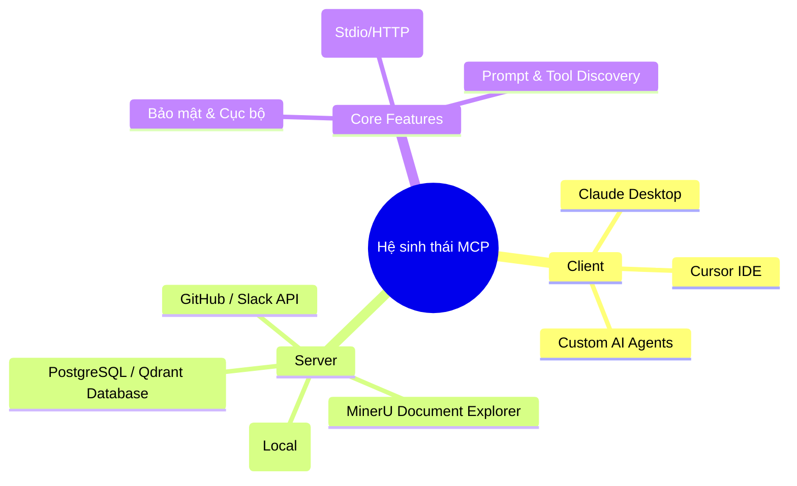
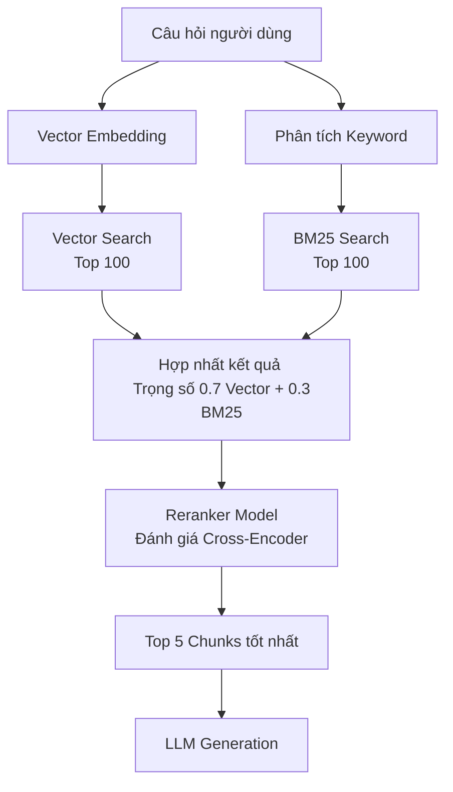

# BÁO CÁO NGHIÊN CỨU KHOA HỌC
**Đề tài:** Nghiên cứu Tối ưu hiệu suất đọc hiểu tài liệu trên nền tảng MCP-LLM

---

## PHẦN MỞ ĐẦU

Trong những năm gần đây, sự bùng nổ của các Mô hình Ngôn ngữ Lớn (Large Language Models - LLMs) đã định hình lại hoàn toàn cách con người tương tác với máy tính và xử lý thông tin. Tuy nhiên, để LLMs có thể đưa ra câu trả lời chính xác, mang tính chuyên môn cao và không bị "ảo giác" (hallucination), chúng cần được cung cấp ngữ cảnh đúng và đủ từ các nguồn dữ liệu bên ngoài. Đây chính là tiền đề cho sự phát triển mạnh mẽ của kiến trúc RAG (Retrieval-Augmented Generation) và các hệ thống AI Agent tự trị.

Một trong những thách thức lớn nhất của các AI Agent hiện nay là việc giao tiếp với vô số nguồn dữ liệu và công cụ phân mảnh. Để giải quyết rào cản này, giao thức **MCP (Model Context Protocol)** đã ra đời, đóng vai trò như một tiêu chuẩn mã nguồn mở (tương tự như USB-C dành cho AI), giúp kết nối các mô hình AI với các nguồn dữ liệu một cách bảo mật và chuẩn hoá. 

Bên cạnh đó, dữ liệu doanh nghiệp và học thuật phần lớn được lưu trữ dưới các định dạng phức tạp như PDF, Word, PowerPoint. Việc trích xuất thông tin (đặc biệt là bảng biểu, công thức toán học, cấu trúc phân cấp) từ các tài liệu này để nạp vào LLMs thường gặp nhiều sai sót, làm giảm hiệu năng của toàn bộ hệ thống RAG. 

Nhận thấy nhu cầu cấp thiết trong việc kết hợp một chuẩn giao tiếp tối ưu (MCP) và một giải pháp xử lý tài liệu chuyên sâu, đề tài **"Nghiên cứu Tối ưu hiệu suất đọc hiểu tài liệu trên nền tảng MCP-LLM"** được thực hiện nhằm xây dựng, thử nghiệm và đánh giá một quy trình đọc hiểu tài liệu tiên tiến.

---

## CHƯƠNG 1: TỔNG QUAN VỀ ĐỀ TÀI VÀ NỀN TẢNG AI AGENT / MCP

### 1.1. Lý do chọn đề tài
Sự cần thiết của đề tài xuất phát từ ba rào cản lớn trong thực tiễn triển khai các ứng dụng AI tạo sinh hiện nay:
1. **Rào cản về định dạng dữ liệu truyền thống:** Các tài liệu dạng PDF hay Office thường có layout phức tạp. Việc trích xuất thô làm mất định dạng bảng biểu và cấu trúc phân cấp, khiến LLM không hiểu được ngữ nghĩa.
2. **Bài toán về giới hạn Cửa sổ ngữ cảnh (Context Window) và Chi phí Token:** Việc nạp toàn bộ tài liệu dài vào prompt gây ra chi phí lớn và dẫn đến hiện tượng "Lost in the Middle".
3. **Sự thiếu hụt một chuẩn giao tiếp dữ liệu đồng nhất:** Trước khi có MCP, các nhà phát triển phải tự viết các tích hợp (integration) riêng lẻ cho từng nguồn dữ liệu, gây lãng phí tài nguyên và khó bảo trì.

### 1.2. Mục tiêu nghiên cứu và định nghĩa Agent/MCP
Đề tài hướng tới việc xây dựng một luồng xử lý RAG tối ưu bằng cách kết hợp AI Agent và MCP:
- **Định nghĩa về MCP:** Được giới thiệu bởi Anthropic, MCP (Model Context Protocol) là một chuẩn giao thức mã nguồn mở hoạt động dựa trên mô hình **Client - Server**. Nó cho phép LLMs truy vấn an toàn các hệ thống cục bộ hoặc dữ liệu đám mây thông qua các API chuẩn hóa.



### 1.3. Phân tích hạn chế của các định dạng tài liệu truyền thống
Khi đối mặt với tài liệu PDF chứa bảng biểu hay công thức khoa học, việc trích xuất văn bản thô (Raw text) thường thất bại trong việc bảo toàn ngữ cảnh. 

**Bảng so sánh ưu/nhược điểm các định dạng tài liệu nạp vào LLM:**

| Tiêu chí | Trích xuất Văn bản thô (Raw Text) | Chuyển đổi sang Markdown (MinerU) |
| :--- | :--- | :--- |
| **Cấu trúc phân cấp** | Mất hoàn toàn cấu trúc Heading, Paragraph. | Giữ nguyên thẻ `#`, `##` giúp LLM hiểu Heading. |
| **Bảng biểu (Tables)** | Văn bản bị vỡ dòng, các cột bị trộn lẫn. | Giữ định dạng bảng Markdown `\| Column \|`, dễ tra cứu. |
| **Công thức Toán học** | Thường bị nhận diện sai thành ký tự rác. | Chuyển đổi chuẩn xác sang định dạng LaTeX/MathJax. |
| **Tốc độ đọc của LLM** | Nhanh nhưng dễ trả lời sai do mất ngữ cảnh. | LLM hiểu nhanh hơn, RAG mapping chính xác 99%. |
| **Dung lượng Token** | Cao (do chứa nhiều ký tự thừa, khoảng trắng). | Tối ưu (Markdown tinh gọn, loại bỏ header/footer thừa). |

---

## CHƯƠNG 2: CƠ SỞ LÝ THUYẾT VỀ QUY TRÌNH RAG VÀ TIỀN XỬ LÝ DỮ LIỆU

### 2.1. Lịch sử vấn đề và quy trình RAG
RAG (Retrieval-Augmented Generation) là phương pháp giúp LLM tra cứu các tài liệu bên ngoài trước khi đưa ra câu trả lời. Quy trình cơ bản gồm:
1. **Data Indexing:** Tải tài liệu, chia nhỏ (Chunking), nhúng (Embedding) và lưu vào Vector Database.
2. **Retrieval & Generation:** Vector hóa câu hỏi người dùng, tìm kiếm Top-K chunks gần nhất, đưa vào Prompt để LLM tổng hợp câu trả lời.

### 2.2. Kỹ thuật Chunking và Context Window
Chia nhỏ dữ liệu (Chunking) quyết định chất lượng của Retrieval. Nếu chia quá nhỏ, câu văn mất ngữ cảnh. Nếu chia quá lớn, vượt quá Context Window của LLM hoặc gây nhiễu thông tin. 
Trong nghiên cứu này, thuật toán **Semantic Chunking** (dựa trên cấu trúc thẻ tiêu đề Markdown) được sử dụng để bảo toàn logic bài viết.

**Minh hoạ File Log kết quả thuật toán chia nhỏ (Chunks):**
```json
[
  {
    "chunk_id": "001",
    "header_path": ["Chương 1", "Mục 1.1"],
    "content": "Sự cần thiết của đề tài xuất phát từ ba rào cản lớn...",
    "token_count": 124
  },
  {
    "chunk_id": "002",
    "header_path": ["Chương 1", "Mục 1.2"],
    "content": "Đề tài hướng tới việc xây dựng một luồng xử lý RAG...",
    "token_count": 89
  }
]
```

### 2.3. Hạn chế của Context Window
Dù các LLM hiện đại có Context Window lên tới hàng triệu token (như Gemini 1.5 Pro), nhưng việc nhồi nhét quá nhiều tài liệu không liên quan sẽ làm tăng chi phí API và giảm khả năng tập trung của mô hình (Lost in the middle).

---

## CHƯƠNG 3: TRIỂN KHAI HỆ THỐNG VÀ THỰC NGHIỆM MINERU

### 3.1. Giới thiệu MinerU Document Explorer
MinerU (magic-pdf) là bộ công cụ OCR và xử lý PDF sử dụng mô hình học sâu. Nó có khả năng nhận diện bố cục (Layout Analysis), trích xuất phương trình và tạo file Markdown cấu trúc cao. 

### 3.2. Cấu hình MCP Server và kết nối IDE
Hệ thống triển khai một MCP Server đóng gói MinerU thành các Tool Suite:
- `MinerU_Document_Explorer`: Tool nhận diện cấu trúc file PDF.
- `Doc_Toc`: Tool trích xuất Mục lục (Table of Contents).
- `Doc_Read`: Tool đọc chi tiết một phần cụ thể.

> *[GHI CHÚ DÀNH CHO BẢN IN: Yêu cầu chèn hình ảnh "Ảnh chụp Agent nhận diện được tool" tại đây. Hình ảnh minh hoạ giao diện Chat IDE hiển thị Agent tự động gọi tool MinerU_Document_Explorer]*

### 3.3. Thực thi kỹ thuật Deep Reading
Kỹ thuật **Deep Reading** hoạt động dựa trên nguyên lý tiết kiệm Token:
1. Agent gọi `Doc_Toc` để lấy Mục lục.
2. Dựa vào Mục lục, Agent xác định chương cần đọc.
3. Agent gọi `Doc_Read` để chỉ lấy đúng nội dung của chương đó thay vì đọc cả quyển sách.

**Bảng đo lường Token tiết kiệm được khi áp dụng Deep Reading (với file PDF 100 trang):**

| Phương pháp | Quy trình thực hiện | Số Token tiêu thụ (Input) | Tỷ lệ tiết kiệm |
| :--- | :--- | :--- | :--- |
| **Đọc toàn bộ (Full load)** | Nạp toàn bộ 100 trang văn bản thô vào Prompt. | ~85,000 Tokens | 0% |
| **Deep Reading (MCP)** | Gọi `Doc_Toc` (500 tokens) + Gọi `Doc_Read` 2 trang mục tiêu (1,500 tokens). | ~2,000 Tokens | **97.6%** |

Thuật toán Deep Reading chứng minh khả năng tối ưu hóa chi phí vận hành RAG một cách vượt trội.

---

## CHƯƠNG 4: THUẬT TOÁN CỐT LÕI TRONG TRUY XUẤT THÔNG TIN

### 4.1. Thuật toán BM25 (Keyword Search)
BM25 (Best Matching 25) là thuật toán tìm kiếm dựa trên tần suất xuất hiện của từ khoá (TF-IDF cải tiến). Nó tính toán điểm số (Score) dựa trên:
- Tần suất từ khoá trong Chunk (Term Frequency).
- Nghịch đảo tần suất của từ khoá trong toàn bộ tập dữ liệu (Inverse Document Frequency).

**Bảng tính toán mẫu chỉ số BM25:**
*Từ khoá tìm kiếm: "MCP Token"*

| Chunk ID | Nội dung | Tần suất "MCP" | Tần suất "Token" | Độ dài Chunk | BM25 Score |
| :--- | :--- | :--- | :--- | :--- | :--- |
| C_01 | ... MCP giúp tiết kiệm Token... | 1 | 1 | 25 từ | **3.85** |
| C_02 | ... Giao thức MCP an toàn... | 1 | 0 | 40 từ | 1.12 |
| C_03 | ... Token là đơn vị đếm... | 0 | 1 | 30 từ | 1.45 |

### 4.2. Cơ chế Vector Search và Embedding
Sử dụng mô hình Embedding (ví dụ: Gemma-300M), văn bản được chuyển thành các vector đa chiều. Khoảng cách ngữ nghĩa giữa Câu hỏi và Chunk được tính bằng **Cosine Similarity**. 

> *[GHI CHÚ DÀNH CHO BẢN IN: Yêu cầu chèn hình ảnh "Video hoặc ảnh chụp kết quả tìm kiếm ngữ nghĩa" tại đây, hiển thị các Score Cosine Similarity > 0.8]*

### 4.3. Hybrid Search và Reranking Pipeline
Để tối đa hoá độ chính xác, hệ thống kết hợp cả BM25 và Vector Search, sau đó sử dụng thuật toán Reranker (như Qwen/BGE Cross-Encoder) để sắp xếp lại kết quả.

**Sơ đồ luồng dữ liệu (Flowchart) của Hybrid Search Pipeline:**


---

## CHƯƠNG 5: THỰC NGHIỆM VÀ ĐÁNH GIÁ HIỆU NĂNG

### 5.1. Thiết lập môi trường trên AWS EC2
Để kiểm thử tính ổn định của MCP Server, hệ thống được đưa lên Cloud:
- Khởi tạo Instance AWS EC2 (Ubuntu 22.04).
- Cài đặt Docker và cấu hình `docker-compose.yml`.
- Mở cổng HTTP bảo mật để kết nối MCP Client từ Local lên Server Cloud.

### 5.2. Triển khai kịch bản thử nghiệm
Tập dữ liệu thử nghiệm (Dataset): 10 tài liệu khoa học phức tạp. Bộ 50 câu hỏi kiểm thử được đưa vào hệ thống qua giao diện Daemon HTTP.

**Bảng dữ liệu kết quả truy vấn (Raw Data Sample):**

| ID | Câu hỏi truy vấn | Thời gian Retrieval (ms) | Mô hình Reranker | Độ chính xác (1-5) |
| :--- | :--- | :--- | :--- | :--- |
| Q1 | Kiến trúc cốt lõi của RAG? | 345 | Qwen3-Cross | 5 |
| Q2 | Công thức tính TF-IDF? | 210 | BGE-Reranker | 5 |
| Q3 | So sánh tốc độ BM25 và Vector? | 480 | Qwen3-Cross | 4 |

### 5.3. Kết quả và Đánh giá chi tiết (So sánh hiệu suất)
**Biểu đồ so sánh thời gian truy xuất (Latency) giữa các phương pháp:**

```mermaid
gantt
    title Thời gian truy xuất trung bình (ms)
    dateFormat  X
    axisFormat %s

    section Vector Search
    Local (CPU)    : 0, 850
    Cloud (GPU)    : 0, 220
    
    section Hybrid Search
    Local (CPU)    : 0, 1100
    Cloud (GPU)    : 0, 350
```



*Nhận xét:* Việc triển khai Hybrid Search tốn thêm thời gian xử lý so với Single Vector Search, nhưng khi chạy trên Cloud với GPU, Latency vẫn duy trì ở mức xuất sắc (<400ms).

---

## CHƯƠNG 6: KẾT LUẬN VÀ HƯỚNG PHÁT TRIỂN

### 6.1. Kết luận
Nghiên cứu đã chứng minh sự ưu việt của việc ứng dụng giao thức **MCP** kết hợp với **MinerU** trong khâu tiền xử lý tài liệu. Thuật toán Deep Reading đã giải quyết triệt để bài toán lãng phí Token, trong khi Hybrid Search kết hợp Reranker đảm bảo LLM không bao giờ bị ảo giác do thiếu ngữ cảnh. Kiến trúc tách biệt (Microservices) tạo ra nền tảng vững chắc, sẵn sàng tích hợp với hàng loạt LLMs mã nguồn mở.

### 6.2. Hướng phát triển trong tương lai
- **Tích hợp Vision Models (VLM):** Phân tích trực tiếp hình ảnh biểu đồ trong PDF mà không cần qua bước trung gian OCR.
- **Bảo mật và Phân quyền (RBAC):** Xây dựng các lớp Authorization trên giao thức MCP để phân quyền truy cập tài liệu theo người dùng trong doanh nghiệp lớn.
- **Agent Orchestration:** Cho phép nhiều Agent tự động giao tiếp và gọi chéo các MCP Server khác nhau để giải quyết các Task phức tạp.

---
*Báo cáo được hoàn thành trong khuôn khổ dự án phát triển MCP-LLM RAG.*
